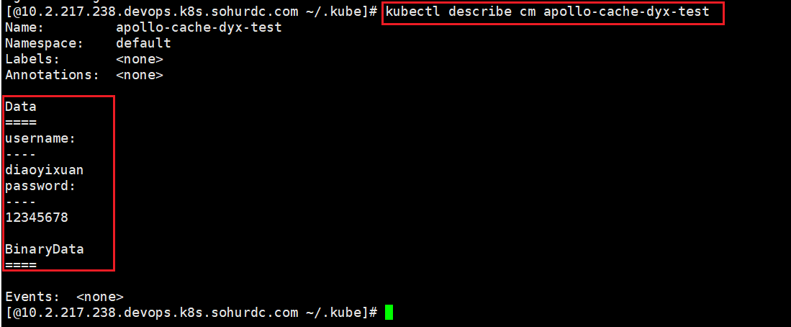
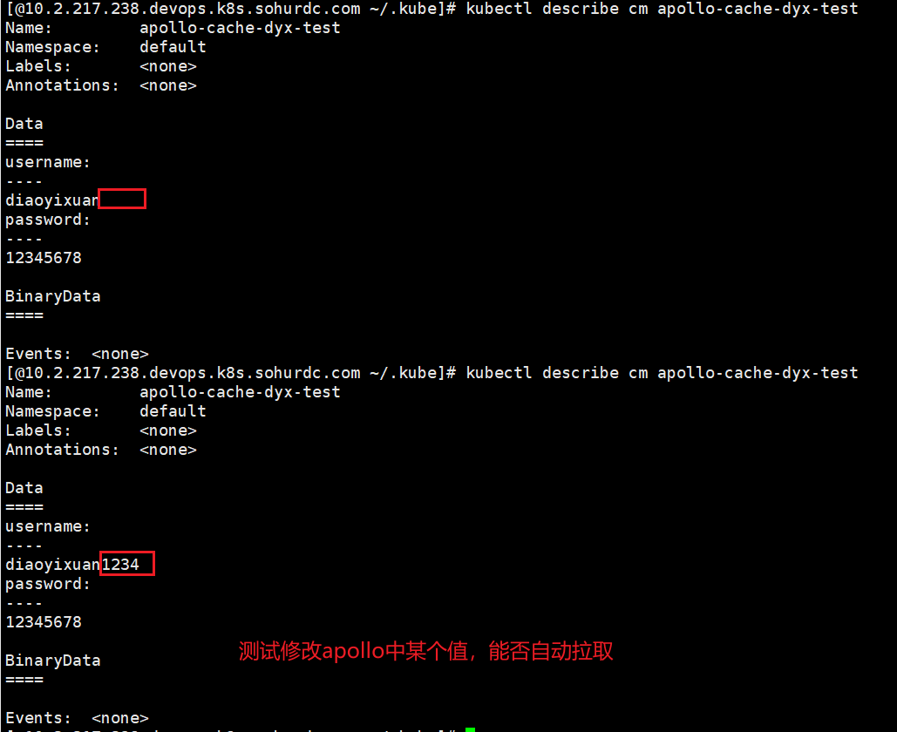
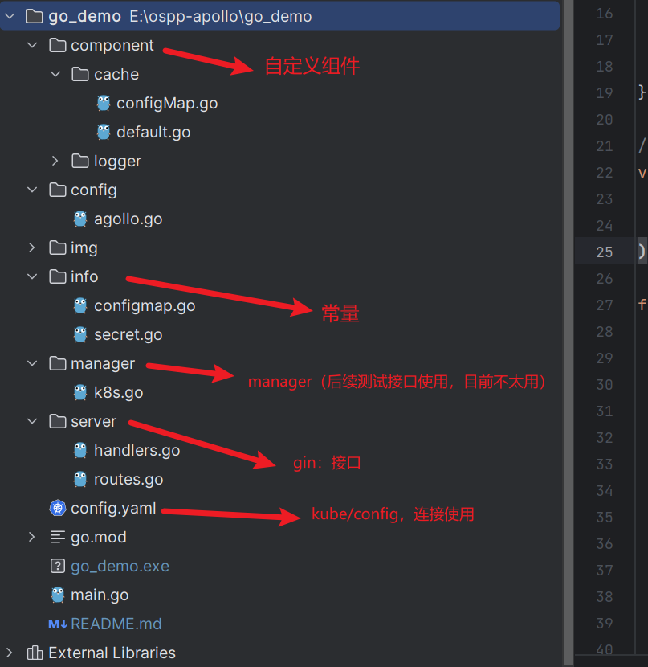

# agollo demo


## 收获:
1. 学习go的开发规范
2. 在阅读完源码后，真实使用agollo，加深对源码的理解
3. 发现可以自定义组件，于是自定义了使用configmap的缓存组件，实现了ospp需求的类似功能
```
agollo.SetCache(&cache.ConfigMapCacheFactory{})
```
4. 自定义缓存组件：使用client-go实现了cache接口定义的方法，跑通了与k8s交互的流程，加深了对client-go的理解


<br>

### 需求实现:

#### apollo灰度配置
将password字段主版本的值设为12345678, 灰度版本值为12345678gray
并在灰度规则中将本地ip设为应用灰度值的机器


#### 运行
1. 在本地启动demo程序，访问apollo配置，成功拿到灰度值 <br>
2. 使用自定义注解，将配置文件写入到configmap中
通过接口测试，本地运行的服务成功拿到灰度值
在kubernetes集群中运行的服务，拿到主版本的值

<br>
经测试，自定义configmap缓存组件能正常所有功能
<br>





### 代码结构

